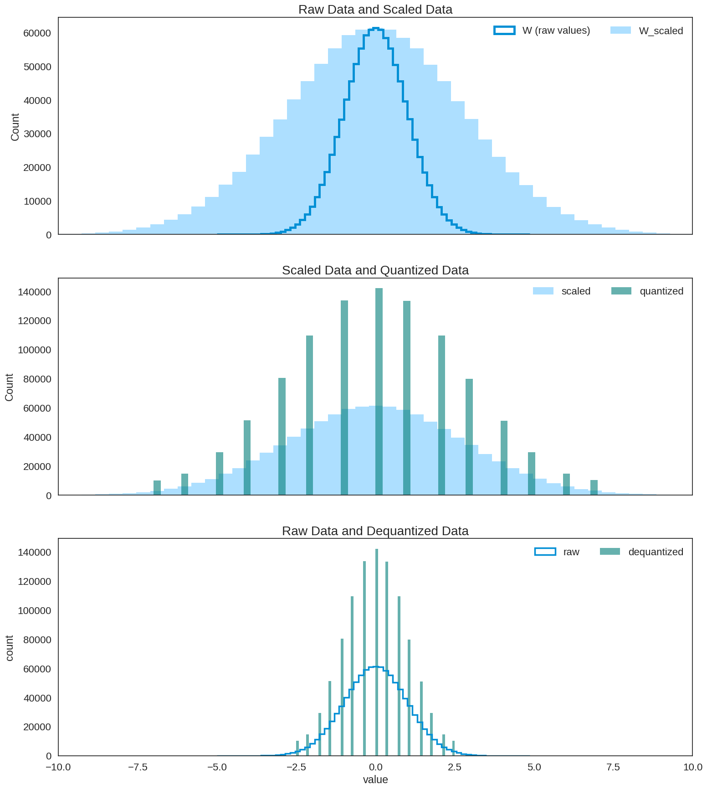
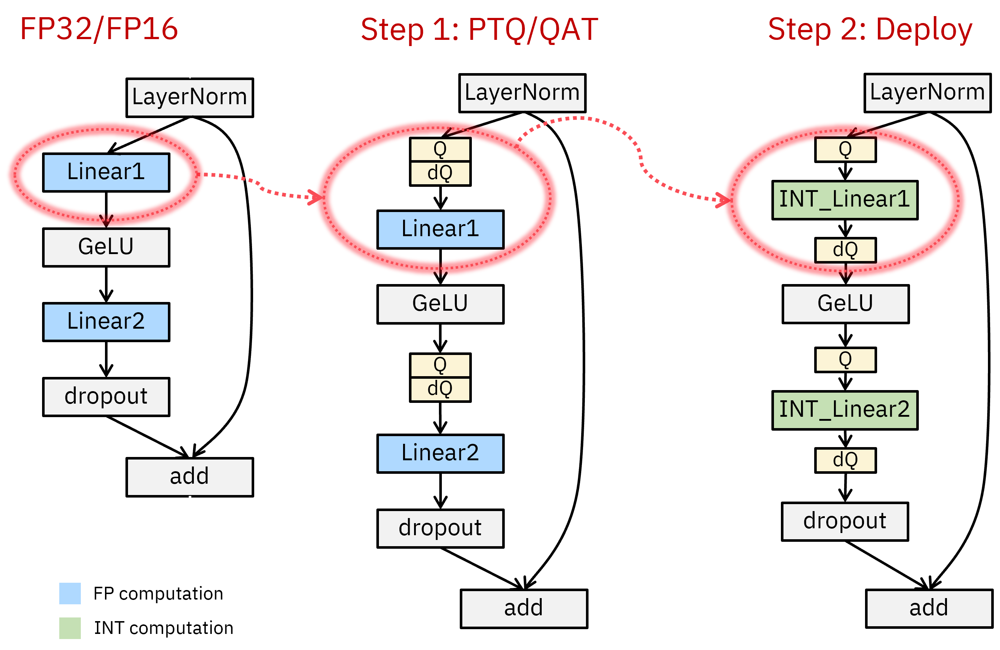
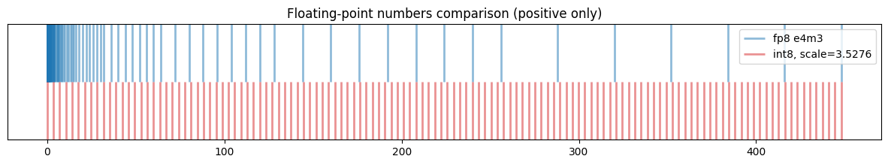
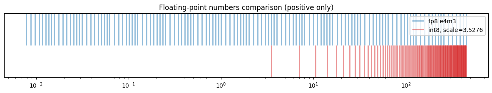
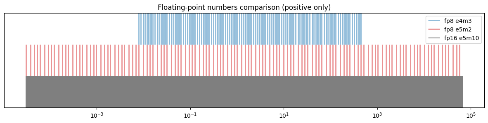

# FMS Model Optimizer Design

## Abstract

FMS Model Optimizer is a framework to research and develop reduced-precision numerical representation of neural networks using [quantization and sparsification techniques](https://proceedings.neurips.cc/paper_files/paper/2022/file/5b5618e7d061748267d74478b7c5b1ab-Paper-Conference.pdf). When these models are properly deployed on specialized hardware, such as modern GPUs, both inference speed and energy consumption will be greatly improved. The goal of this package is to provide a variety of popular quantization methods out-of-the-box with a simple interface while maintaining flexibility so that new customized methods can be added and experimented with easily.

## Motivation

Quantization can dramatically reduce the memory and computation required to run a model, which is a crucial technique as we extend into the era of large language models (LLMs). 

The FMS Model Optimizer goals are:

- To provide an extendable framework for optimization techniques like quantization on LLMs
- To generate quantized checkpoints for model serving purposes or as a base model for further studies
- To provide capability to verify the inference performance of resulting quantized models with specialized hardware. For example, once an INT8 model is generated, users may want to utilize the real INT compute engine on GPU to run evaluation on this model and confirm the resulting accuracy

## Background

### Quantization is a lossy compression

A 32 bit floating-point tensor with $N$ elements will need $4N$ bytes memory during computation. If we can express each element with a 4-bit integer instead, memory consumption will be reduced to $0.5N$ bytes only. One simple way to achieve this "compression" is through quantization process as below:

$$W_q = clip(\lfloor\frac{W}{s_w}+zp\rceil, lower, upper)$$
$$W_{dq} = (W_q - zp) * s_w$$

where $W$ is a random Gaussian floating point tensor with $\mu=0,\sigma=1$, $s_w$ is a scaling factor, here we simply choose $s_w = 2.5/7$, $\lfloor  \rceil$ is rounding operator, $clip(X,lower,upper)$ is to clip X tensor to the range of $[lower, upper]$, i.e. any elements greater than $upper$ will become $upper$. here clip bound was chosen to be $[-7, 7]$, and $zp$ is zero-point, for symmetric quantization like this case, we simply choose $zp=0$. **Note** that the first equation is usually referred to quantization step as the resulting $W_q$ is an integer tensor. The second is referred to as dequantization step as $W_{dq}$ is a quantized floating point tensor.

(Detailed example can be found in this [tutorial notebook](../tutorials/quantization_tutorial.ipynb). )

The quantization process can be illustrated in the following plots:
- First row: scaling of $W$, e.g. 2.5 in the original tensor will be translated to 7.
- Second row: quantize (round and clip), e.g. numbers ranged [6.5, 7.5) will become 7.
- Third row: dequantize, scale the integers from [-7, 7] back to [-2.5, 2.5].

**NOTE:** Rounding process will introduce approximation errors, or another way to look at it is that some information in the original tensor will be lost.


### Quantization-aware training (QAT)

In order to accommodate the quantization errors, one straightforward technique is to take quantization/dequantization into account during the training process, hence the name quantization-aware training [(QAT)](https://arxiv.org/pdf/1712.05877), as illustrated by Step 1 of the following figure. The training optimizer will then adjust the parameters of the model, e.g. weights, accordingly so that the resulting accuracy will be comparable to the original FP32 model.

There are many other techniques, such as post-training quantization ([PTQ](https://arxiv.org/abs/2102.05426)), that can achieve similar outcome. Users will need to pick the proper method for their specific task based on model size, dataset size, resource available, and other considerations.




### Deployment of the quantized model

When we performed QAT in the previous section, one should note that all the matrix multiplications are still done in full precision. In other words, the QAT step is just to prepare the model for deployment, it will not provide any speed-up. In fact, QAT will slow down the execution by quite a bit because of the additional quant/dequant operations on top of the full precision forward passes and customized backward passes.

One will need to deploy the model using specialized hardware in order to fully benefit from a quantized model. For example, if an INT8 matrix multiplication is needed in an INT8 quantized model but PyTorch does not have native support for this operation yet, users will need to write an "external kernel" (often in CUDA) to assign the computation to the true INT8 compute engine. Or, users may utilize inference serving engines like [TensorRT-LLM](https://github.com/NVIDIA/TensorRT-LLM) or [vLLM](https://github.com/vllm-project/vllm) which provide their own implementation of  external kernels. TensorRT-LLM and vLLM usually can provide better inference performance due to their highly optimized kernels.

**Note** FMS Model Optimizer also provides a few simple INT kernels, which are easy to use and very efficient compared to typical PyTorch FP16, but by no means the most optimized kernels. The main purpose for these kernels is to verify the INT model behavior at deployment stage rather than encourage users to serve models with our kernels.

### 8-bit floating point (FP8) format

Because an 8-bit floating point can only represent at most 256 numbers for a given range, representable numbers are separated by a certain gap in between, hence, it is a "quantized format" similar to INT8. Furthermore, for typical GPUs, e.g. H100 and MI300, FP8 and INT8 are usually designed to have the same computation throughput (although, not necessarily with the same energy efficiency. Also custom accelerators may have different design choices.) But these formats have very different behavior when it comes to quantization. Here are a few things to keep in mind when choosing a 8-bit numerical format for your task.

#### 1. Representation range and interval

A N-bit floating-point number is represented as N consecutive bits composed of 3 sub-parts, i.e. *(sign bit, exponent bits, mantissa bits)*. For example, a FP8 number may allocate its 8 bits in (1, 4, 3) or (1, 5, 2) manner. The real number for a given bit representation can be calculated by:
$$-1^{sign}*(1.mantissa)*2^{exponent - bias}$$
where $bias = 2^{len(exponent\_bits) -1 } -1$. Some more examples and details can be found [here](https://en.wikipedia.org/wiki/Single-precision_floating-point_format).

Here we plot all the representable positive numbers for both INT8 and FP8 formats on linear scale (upper plot) and log scale (lower plot). For easy comparison purpose, both formats are scaled to the same max value, i.e. 448 in this case. We can see that FP8 has higher "resolution" for the smaller numbers in this range while INT8 has higher resolution for the larger numbers.



#### 2. Ease of use
Instead of using the quantization formula introduced previously, FP8 could be converted from FP16 through a simple "type casting", which is close to a truncation operation of the extra bits. But one should keep in mind that there are two flavors of FP8 commonly in use, i.e. `e4m3` and `e5m2`, which means "4-bit exponent 3-bit mantissa" and "5-bit exponent 2-bit mantissa", respectively. Their resolutions and representable ranges, compared to FP16's, are illustrated below.
> [!NOTE]
> FP16 has similar representable range as `e5m2` but with so much more representable numbers available. That's why it is usually considered as a "continuous format" instead of "quantized format."



#### 3. Hardware availability
Native FP8 computation is only supported by newer GPUs, such as H100. Older GPUs might be able to support a scheme where data is stored in FP8 but compute is done in FP16.

FMS Model Optimizer supports FP8 in two ways:
1. Deployable through vLLM. One could create FP8 checkpoints that can be later deployed with vLLM. This option simply invokes `llm-compressor` package (for now, may integrate with internal functions in the near future.) See [example](../examples/FP8_QUANT/README.md)
2. Simulation only, which allows users to create and experiment different scaling methods, e.g. per-token min/max. But users may need to create their own external kernels when deployment is needed. See [example](../examples/DQ_SQ/README.md)

### GPTQ (weight-only compression, or sometimes referred to as W4A16)

For generative LLMs, very often the bottleneck of inference is no longer the computation itself but the data transfer. In such case, all we need is an efficient compression method to reduce the model size in memory, together with an efficient GPU kernel that can bring in the compressed data and only decompress it at GPU cache-level right before performing an FP16 computation. This approach is very powerful because it could reduce the number of GPUs for serving the model by 4X without sacrificing inference speed. (Some constraints may apply, such as batch size cannot exceed a certain number.) FMS Model Optimizer supports this method simply by utilizing `gptqmodel` package. See this [example](../examples/GPTQ/)


## Specification

### Architecture

The key architectural components are:
1. **`model_analyzer`**, which traces the model and identifies the layers/operations to be quantized or to be skipped. It will try to recognize several well-known structures and configure based on best practice. However, users could also choose to bypass the tracing and manually specify the desired configuration with full flexibility.
2. **A set of `wrappers`**. As shown in the figure above, the preparation for QAT and deployment can be viewed as a "layer swapping" process. One could identify a desired `torch.nn.Linear` layer to be quantized, e.g. Linear1 in the plot, and replace it with a `QLinear` wrapper, which contains a set of `quantizers` that can quantize/dequantize the inputs and weights before the Linear operation. Similarly, the `QLinear` wrapper for deployment stage will quantize the inputs, perform INT matmul, then dequantize the outcome. It is mathematically equivalent to the wrapper used in QAT, but it can utilize the INT compute engine.


### Interfaces

There are two main user interfaces:

1. A Python script `fms_mo/run_quant.py` which provides a means to call different optimization techniques like GPTQ, FP8, etc. For example, GPTQ can be run on the `Maykeye/TinyLLama-v0` model as follows:

```shell
python -m fms_mo.run_quant --model_name_or_path Maykeye/TinyLLama-v0 \
      --output_dir TinyLLama-v0-gptq --quant_method gptq --training_data_path data
```

2. Python functions which wrap model optimizer capability:

      - `quantize()`: Main entry point to quantize a given model with a set of specified hyperparameters
      - `qmodel_prep()`: Prepare a PyTorch model for the quantization process with more fine controls

The [examples](./examples) directory contains examples of how to use these two approaches for different optimization techniques.
